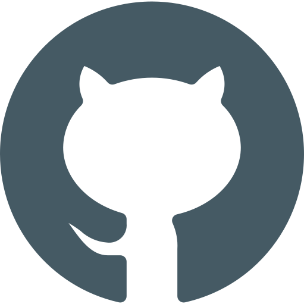

<!-- PROJECT LOGO -->
<br />
<p align="center">
  <a href="https://github.com/Broman3113/todo-on-apollo">
    
  </a>

<h3 align="center">Todo on Apollo</h3>

  <p align="center">
    Explanation in using the project.
    <br />
    <a href="https://github.com/Broman3113/todo-on-apollo"><strong>Explore the docs »</strong></a>
    <br />
    <br />
  </p>


<!-- TABLE OF CONTENTS -->
<details open="open">
  <summary>Table of Contents</summary>
  <ol>
    <li>
      <a href="#about-the-project">About The Project</a>
      <ul>
        <li><a href="#built-with">Built With</a></li>
      </ul>
    </li>
    <li>
      <a href="#getting-started">Getting Started</a>
      <ul>
        <li><a href="#installation">Installation</a></li>
      </ul>
    </li>
    <li><a href="#contact">Contact</a></li>
  </ol>
</details>


<!-- ABOUT THE PROJECT -->

## About The Project

A simple todo app using Apollo Client and GraphQL. 
The app is using a json-graphql-server to simulate a backend. It is possible to display, add, delete and update todos.

### Built With

This project was built using these technologies:

* [React](https://ru.reactjs.org/)
* [GraphQL](https://graphql.org/)
* [Apollo](https://www.apollographql.com/docs/react/)
* [Chakra UI](https://chakra-ui.com/)
* [json-graphql-server](https://www.npmjs.com/package/json-graphql-server)

<!-- GETTING STARTED -->

## Getting Started

To get a local copy up and running follow these simple example steps.

### Installation

1. Clone the repo
   ```sh
   git clone https://github.com/Broman3113/todo-on-apollo.git
   ```
2. Install NPM packages
   ```sh
   npm install
   ```
3. To build dev project and run it
   ```sh
   npm start
   ```

## Contact

[Andrey Borbot](https://github.com/Broman3113)

Project Link: [https://github.com/Broman3113/todo-on-apollo](https://github.com/Broman3113/todo-on-apollo)

[product-screenshot]: ./github.svg
